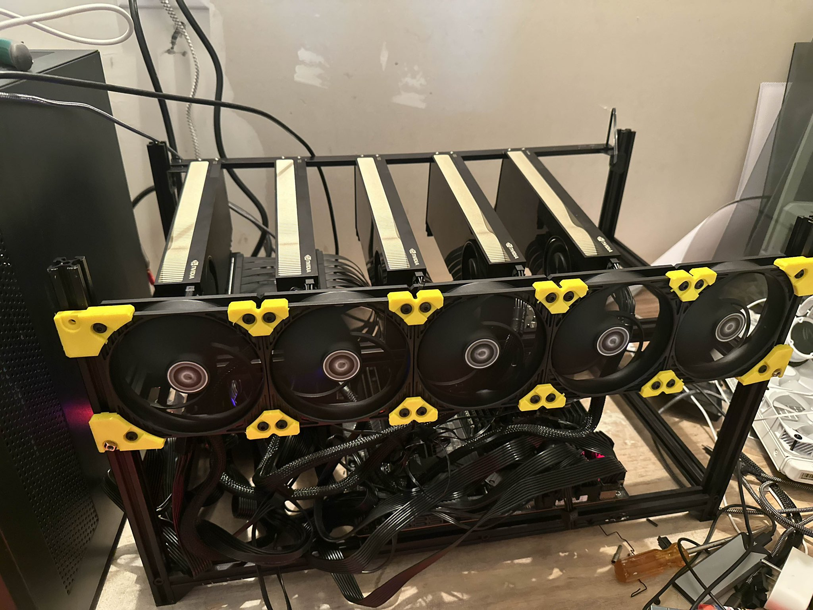

As the title states, the Workhorse is now dead. 

Gutted. 

And thrown together with new parts.

The only two pieces that remain the same are:
- The 6000 ADA
- One PSU

First though, let's talk about *why* you're staring at a ~40k machine

## My motivation

I'm **not** here to tell you to go spend ~40-50k on a new rig. However, instead I'm here 
to detail my (thinly veiled) excuse to go buy these.

With the release of Kimi K2 and other such large models, I use them daily in my life.
My goal originally was to get 2 M3 Ultras, smack them together, get distributed inference going,
and have a gigantic 1T param model working at home.

A month of pain and suffering later, and MLX just isn't there (yet) for my needs. 

Now let's talk about these cards. The Blackwell Max-Q's.

- 300w max draw
- **96GB of VRAM**
- ~10-20% less performant than the full 600w variant.

That's some *insane* compute in a small package. 

With all of my own experiments with distributed training (and my course), my 2 4090's and the 6000 ADA
just could not get me to run experiments the way I need to.

For example, when training it's ~16x the memory cost to train a model in terms of VRAM. 2x 4090's lets you get
a 3 billion parameter model (and it will take ages to get anything done.)

With 384GB of VRAM across the cards, I can experiment with pipeline or tensor parallelism with models of up to
roughly 20 billion parameters (though realistically only 8 when you consider good seq_len etc).

Along with this, they're beasts for inference since I can run a model that's roughly ~600B param or so quantized. 

## The Build

Now, let's talk about costs (ew). First thing **I will acknowledge**: I got PCIe-5 based GPUs with a PCIe-4 based motherboard.

Some performance is left on the table, yes. However this build is already insanely expensive (for a consumer) and I didn't want 
to drop another few thousand $$$ at the time. That could change in the future, who knows.

{Everything was purchased from eBay}

**Setup:**

- Motherboard: ASUS WRX80E-SAGE Pro WS SE ($636)
- CPU: AMD Ryzen Threadripper Pro 5955WX ($969)
- Cooler: Noctua NH-U12S TR4-SP3 ($115)
- RAM: 2x A-Tech 128GB 4x 32GB 3200 RDIMM EEC Memory ($709)
- Case: Veddha V4C 6-GPU Mining Case ($56)
- GPUs: 4x RTX PRO 6000 Blackwell Max-Q ($39,236)
        1x RTX 6000 ADA (Bought off a friend)

## Every build has quirks right?

So, one very frustrating part of this build is that this particular mining rig case was *not meant for this large of a motherboard*.

It took a few trips to the local hardware store, some drillbits, and moving the holes a few inches down the side to get the motherboard to 
*kind of* stay on, but it works. This was my first time ever getting a mining-rig style frame, and as a result mistakes are bound to happen.

## What on earth are you going to do with this??

Mainly research. I've been thinking of years to make a "poor man's" guide to FP8, and so I'm currently running a wide sweep of experiments 
on that now. 

I also will be finally able to host very large models (including with CPU offloading from the 256GB of ECC memory I have) and start 
playing around with how that works more.

Would I recommend this to *most* people? **No**. From my early results, if you're considering a build like this, just get 2. That alone 
is enough for you to see benefits from FP8, and you can train a 12 billion parameter model if you're careful.

We live in a world where VRAM is king, and I'm **not** saying to go into debt to buy this card. But, if you've been sitting on your 
cards for a number of years, and want 4x the vram of a 4090 using less power than it, the max-q is not a bad option.